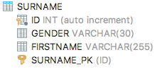
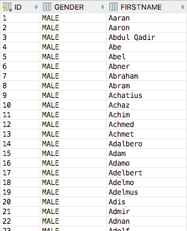
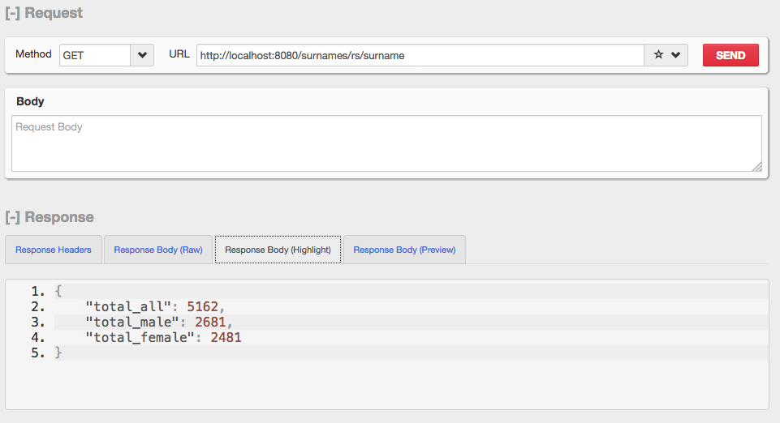
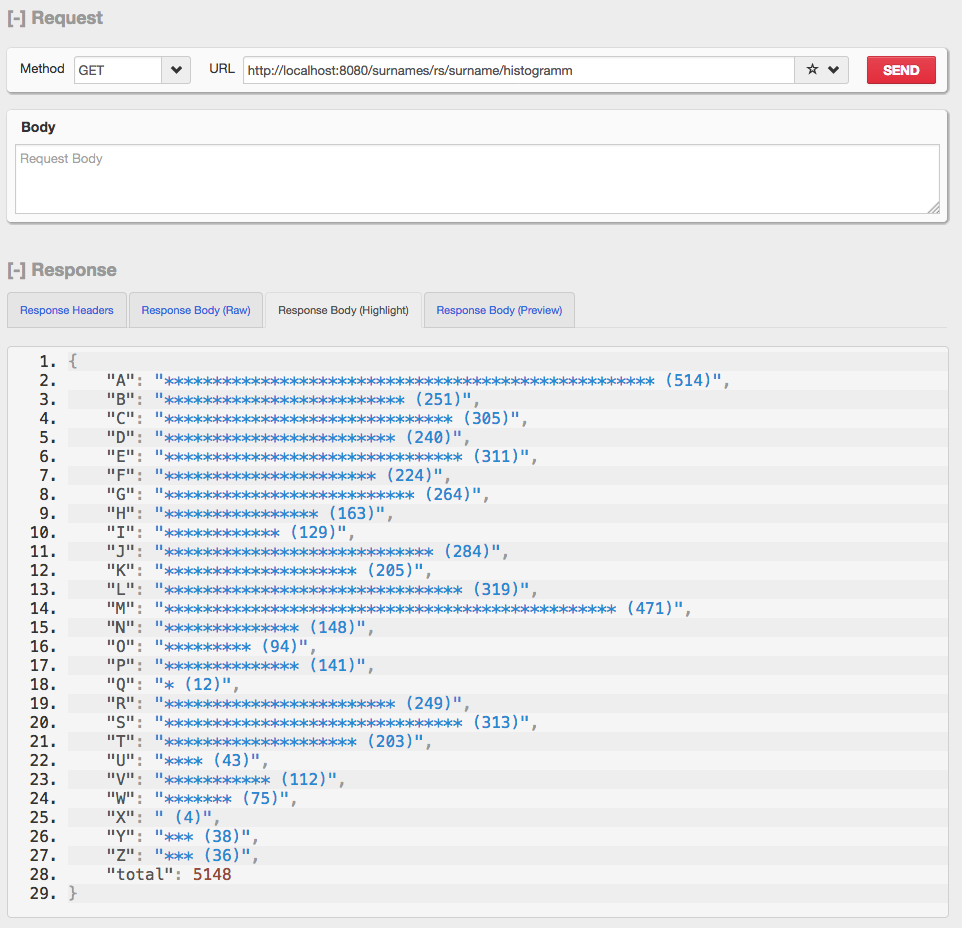

# Übung Surnames

## Lehrziele

- JPA
- REST-Service

## Aufgabenstellung
- Klonen sie das entsprechende JavaEE - Projekt
- Importieren Sie die beiden csv-Dateien im **resources**-Ordner in die Datenbank.  
- Dabei ist zu beachten, dass die Vornamen mit dem richtigen Geschlecht versehen werden.  

## Datenbank

- Benennen Sie den Primary Key: SURNAME_PK
- Anführungszeichen dürfen in der DB nicht enthalten sein
- Verwenden Sie enumerations für **Gender** und **DatabaseAction**

## Endpoints

zum Ausprobieren verwenden Sie den **Postman** oder den 
[RESTClient](https://addons.mozilla.org/de/firefox/addon/restclient/) für Firefox

### Übersicht

### Histogramm

### CRUD-Funktionalität
Erstellen Sie die geeigneten Methoden für die CRUD-Funktionalität.  
Beachten Sie, dass keine Namen doppelt gespeichert werden dürfen (ausser den bereits vorhandenen doppelten Namen)

# Abgabe

- Pushen Sie das Repo

[comment]: # (pandoc README.md -f markdown -t html -s -o README.html)